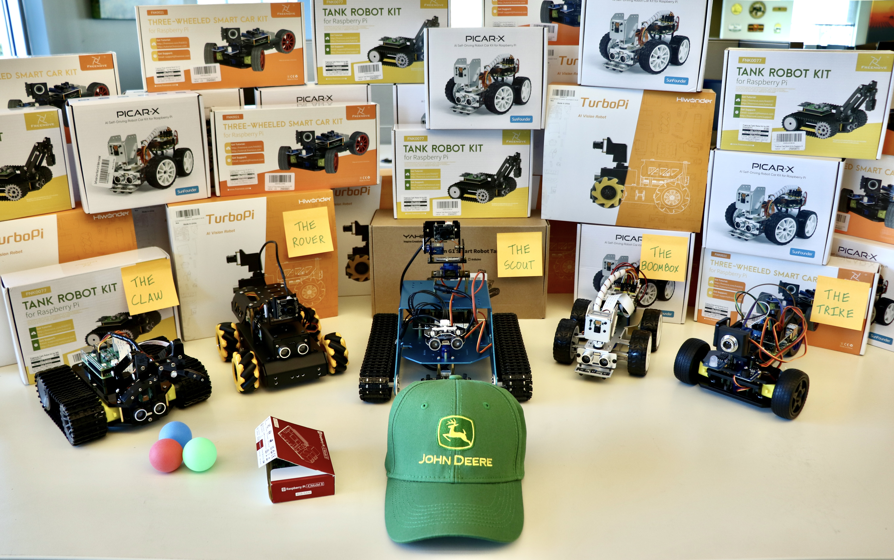
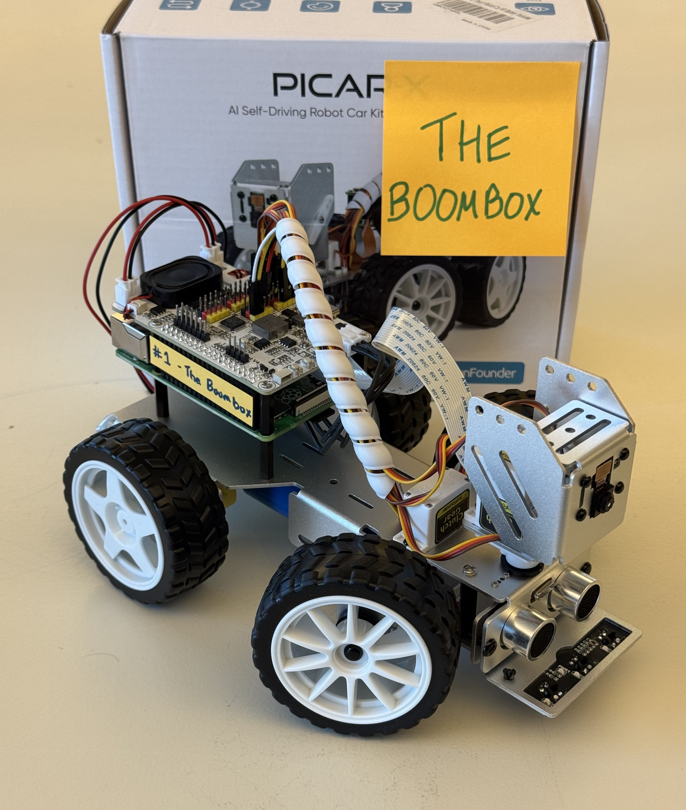
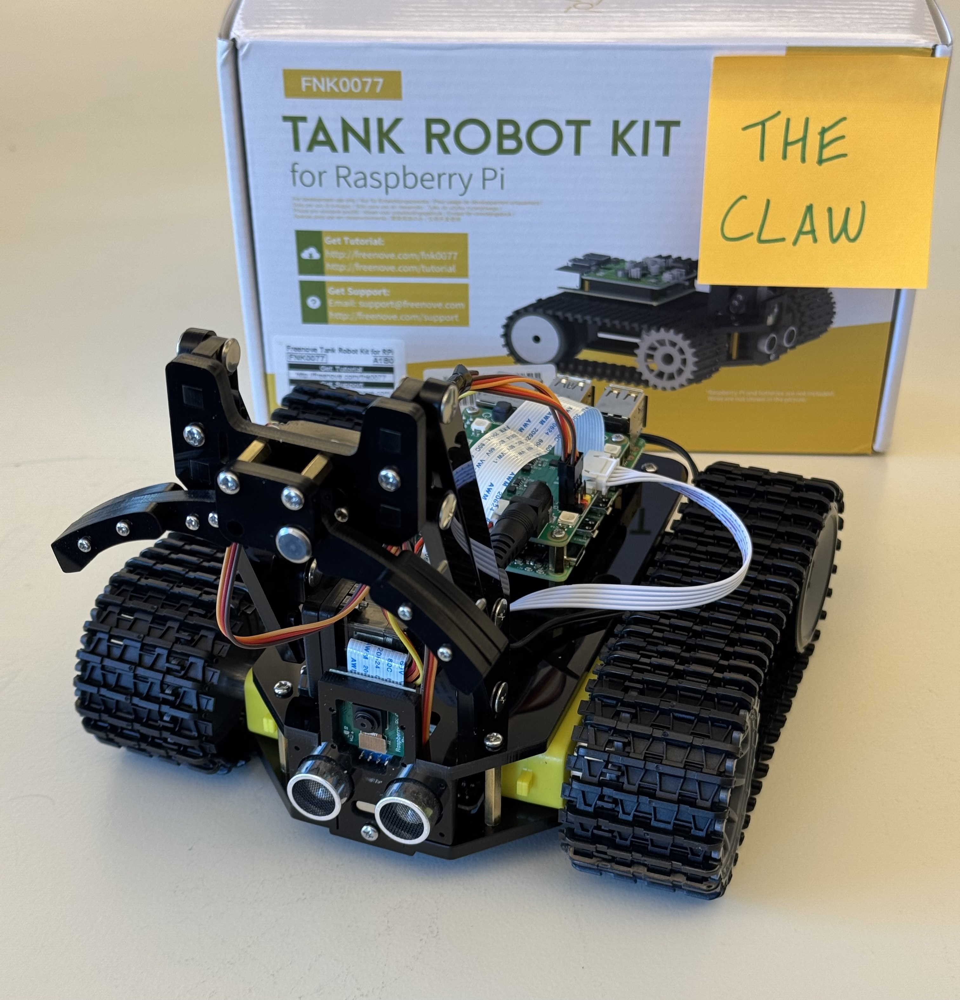
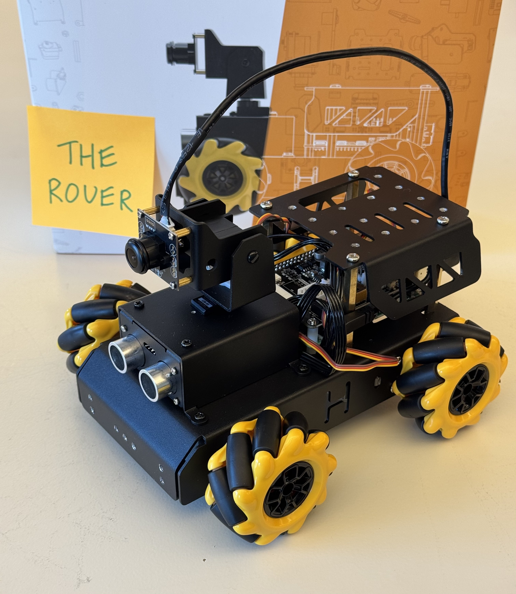
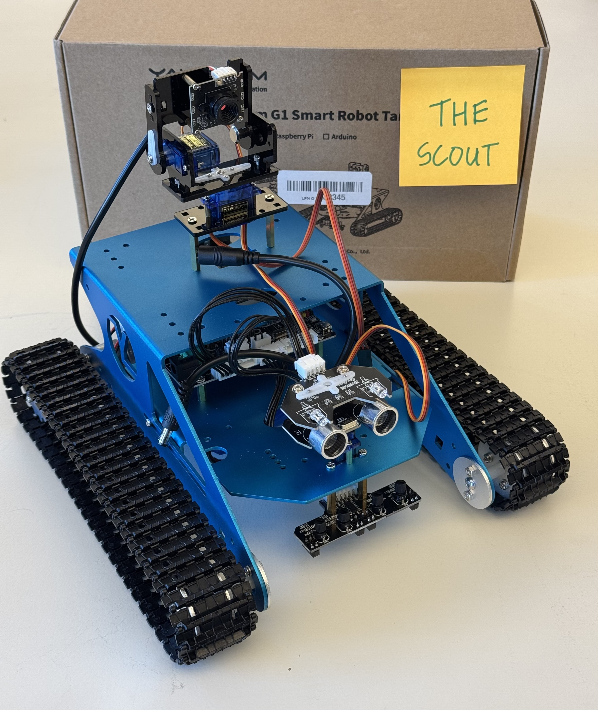
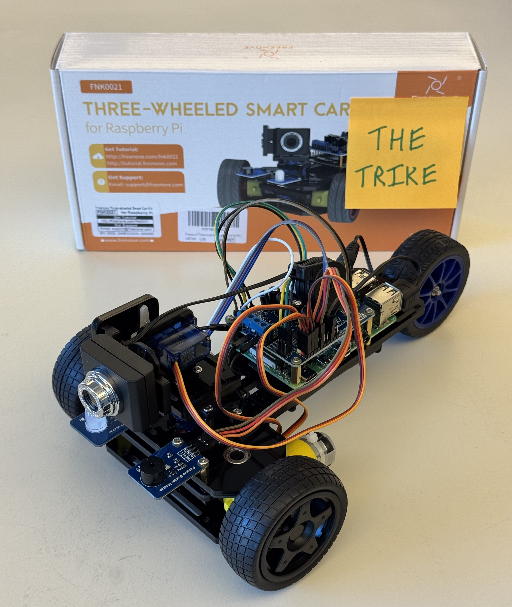
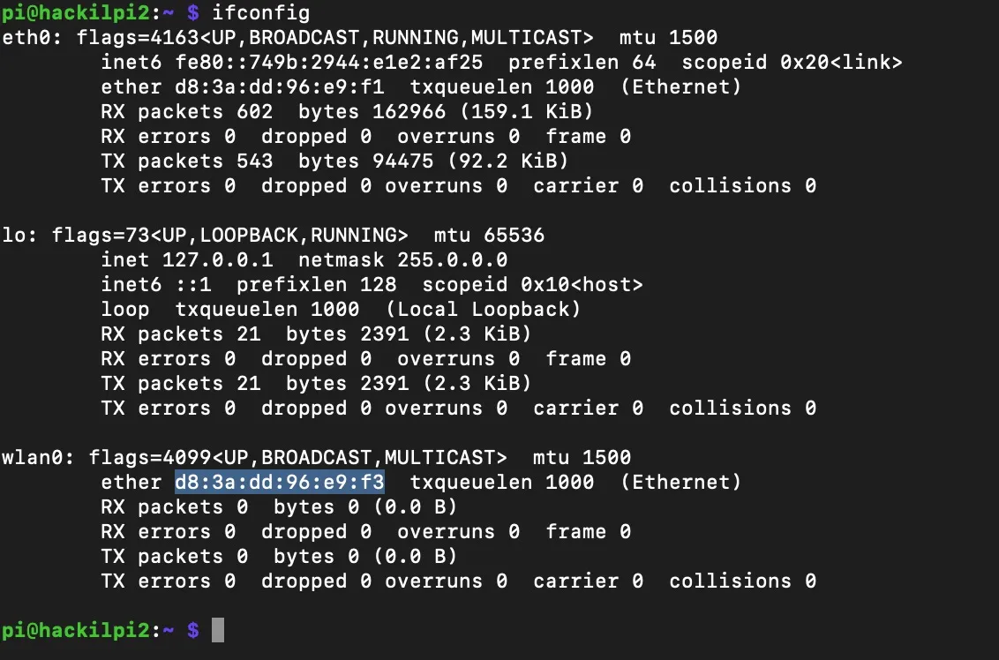
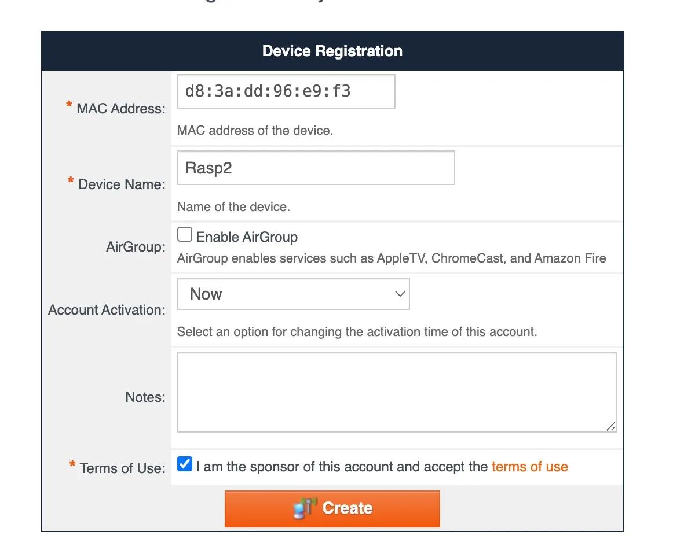

[jackson_innovation_studio]: https://mechse.illinois.edu/undergraduate/makerworks/jackson-innovation-studio
[boombox_branch]: https://github.com/jameskabbes/HackIllinois2025/tree/the_boombox
[claw_branch]: https://github.com/jameskabbes/HackIllinois2025/tree/the_claw
[rover_branch]: https://github.com/jameskabbes/HackIllinois2025/tree/the_rover
[scout_branch]: https://github.com/jameskabbes/HackIllinois2025/tree/the_scout
[trike_branch]: https://github.com/jameskabbes/HackIllinois2025/tree/the_trike

<h1 align="center">
John Deere | HackIllinois 2025
</h1>

<p align="center">
  
</p>



<br>

# Table of Contents

- [Prompt](#prompt)
  - [Submission Criteria](#submission-criteria)
  - [Scoring Criteria](#scoring-criteria)
  - [Integrity](#integrity)
  - [Jackson Innovation Studio](#jackson-innovation-studio)
- [Kits](#kits)
- [Side Quest - Fastest Line Follower](#side-quest---fastest-line-follower)
- [Raspberry Pi](#raspberry-pi)

  - [Setup Instructions](#setup-instructions)
  - [Connecting to your Raspberry Pi](#connecting-to-your-raspberry-pi)
    - [Keyboard, Mouse, Monitor](#keyboard-mouse-monitor)
    - [SSH](#ssh-command-line-access)
    - [VNC](#vnc-graphical-access)
  - [Secure Copy](#secure-copy)
  - [Find IP Address](#find-ip-address)
  - [Other Tips](#other-tips)
    - [Connecting to Wifi](#connecting-to-wifi)
    - [Connecting to IllinoisNet_Guest](#connecting-to-illinoisnet_guest)

# Prompt

<p align="center">
  <strong>Autonomous Vehicles</strong>
</p>

John Deere innovates on behalf of humanity.

It doesn’t matter if you’ve never driven a tractor, mowed a lawn, or operated a dozer. With our role in helping produce food, fiber, fuel, and infrastructure, we work for every single person on the planet.

<div style="display: flex; justify-content: center">
  <div style="display: flex; flex-direction: column; width: 75%">
    <p align="center">
      <em>
        "We don’t create tech for tech’s sake. There’s purpose behind everything we do, so that our customers have the tools they need to tackle some of the world’s greatest challenges."
      </em>
      <br><br>
      <strong>John May</strong>
      <br>
      <em>Chairman and CEO | John Deere</em>
  </div>
</div>

Along our journey of creating exceptional tools for our customers, we have become pioneers in the autonomous vehicle industry:

- [460 P-Tier Autonomous Articulated Dump Truck](https://www.youtube.com/watch?v=DeT_4fmndr8): John Deere's first autonomous piece of construction equipment
- [Autonomous 8R Tractor](https://www.youtube.com/watch?v=QvFoRk4JsPc): Designed to autonomously perform various agricultural tasks while maintaining precision and productivity
- [StarFire™](https://www.deere.com/en/technology-products/precision-ag-technology/): Track your equipment's location down to the inch
- [AutoTrac™](https://www.deere.com/en/technology-products/precision-ag-technology/guidance/auto-trac/): Achieve automated, hands-free guidance for your field operations, increasing efficiency and reducing operator fatigue
- [See & Spray™ Ultimate](https://www.deere.com/en/sprayers/see-spray-ultimate/): Detect weeds from plants in real time using computer vision-enabled sprayers
- [John Deere Operations Center™](https://www.deere.com/en/technology-products/precision-ag-technology/operations-center/): Setup, manager, and monitor critical jobs on your farm from anywhere in the world
- [Machine Sync](https://www.deere.com/en/technology-products/precision-ag-technology/guidance/machine-sync/): Connected machines working simultaneously for maximum productivity in the field

<br>
Now, let's see what you can build.

<br>
<br>

<p align="center">
  <strong>Build your own autonomous vehicle</strong>
</p>

<br>

For your HackIllinois 2025 John Deere prompt, <strong>you are tasked with building your own autonomous vehicle, a vehicle that solves any problem that you define.</strong>

It is up to each team to determine what _problem_ your vehicle solves. Does it drive down the road? Deliver food? Solve a maze? Plant a corn field? It could be something useful, something fun, or anything you can imagine. The only stipulation is that your vehicle:

- Solves the problem autonomously, that is, makes decisions on its own
- Completes the [kit-specific requirements](#kits)

Each team is supplied with a kit. Teams are welcome to add to the kit, remove from the kit, and rearrange the pieces of the kit as needed. Teams are not required to use all items in the kit. Certain kits require that specific sensors and mechanisms are utilized.

Like many problems at John Deere, this prompt requires more than just a software solution, it requires a solution at the intersection of mechanical systems, electrical systems, sensors, data, automation, programming, and of course, creativity.

Good luck!

## Submission Criteria

To be considered for awards, submissions must contain:

- Devpost writeup
  - Codebase
  - Problem description
  - Solution explanation
  - Video of the vehicle working
- A functioning vehicle during a 5-minute live demo on Sunday, March 2nd

## Scoring Criteria

Submissions will be assessed by the following criteria:

- **Problem Complexity**: how complex is your problem?
- **Solution Creativity**: how creative is your solution?
- **Functionality**: how successfully does your vehicle solve your defined problem autonomously?

## Integrity

You are encouraged to use any open source and AI tools you wish. Be sure to give proper recognition where required.

## John Deere Office Hours

We have parterned with the [Jackson Innovation Studio][jackson_innovation_studio] on campus to give you access to any tools you might need. The studio provides access to 3D printers, multimeters, screwdrivers, tape, and anything else you might need.

John Deere engineers who work on autonomous systems professionally will be present to mentor participating teams. The space will be available to participants at the following times:

- Friday, February 28: 9:30pm - midnight
- Saturday, March 1: 11:00am - 7:00pm

The Jackson Innovation Studio is located in the basement of the Sidney Lu Mechanical Engineering Building at [1206 W Green St, Urbana, IL 61801, Room 0100](https://maps.app.goo.gl/Gp97vbMnAPboCCGY8)

## Awards

- 1st place
- Honorable mention
- Most Creative Solution
- [Side Quest Champion - Fastest Line Follower](#side-quest---fastest-line-follower)

## Prizes

- 1st place: Additional Raspberry Pi 4B and vehicle kit for all team members
- All award winners: One team will be invited to present their solution at [AgTech Summit](https://researchpark.illinois.edu/all-events/agtechsummit/)

# Side Quest - Fastest Line Follower

TBD

fill out information regarding the fastest line follower side quest

- black tape on white floor
- showcase left/right signage (colors, words, arrows, etc.)

# Kits

Click on the link for each kit to read more about it, the kit-specific prompt requirements, and setup instructions.

<table>
    <thead>
        <tr>
            <th>Name</th>
            <th>Assembled Kit</th>
            <th>Solution Requirements</th>
            <th>Kit Quantity</th>
        </tr>
    </thead>
    <tbody>
        <tr>
            <td><a href="https://github.com/jameskabbes/HackIllinois2025/tree/the_boombox">The Boombox</a></td>
            <td></td>
            <td>- camera, speaker</td>
            <td>10</td>
        </tr>
        <tr>
            <td><a href="https://github.com/jameskabbes/HackIllinois2025/tree/the_claw">The Claw</a></td>
            <td></td>
            <td>- camera, the claw</td>
            <td>6</td>
        </tr>
        <tr>
            <td><a href="https://github.com/jameskabbes/HackIllinois2025/tree/the_rover">The Rover</a></td>
            <td></td>
            <td>- camera, line-following sensors</td>
            <td>7</td>
        </tr>
        <tr>
            <td><a href="https://github.com/jameskabbes/HackIllinois2025/tree/the_scout">The Scout</a></td>
            <td></td>
            <td>- camera, ultrasonic sensor, all servo motors</td>
            <td>1</td>
        </tr>
        <tr>
            <td><a href="https://github.com/jameskabbes/HackIllinois2025/tree/the_trike">The Trike</a></td>
            <td></td>
            <td>- camera, all servo motors</td>
            <td>7</td>
        </tr>
    </tbody>
</table>

<br>

<table>
    <thead>
        <tr>
            <th>Detail</th>
            <th><a href="https://github.com/jameskabbes/HackIllinois2025/tree/the_boombox">The Boombox</a></th>
            <th><a href="https://github.com/jameskabbes/HackIllinois2025/tree/the_claw">The Claw</a></th>
            <th><a href="https://github.com/jameskabbes/HackIllinois2025/tree/the_rover">The Rover</a></th>
            <th><a href="https://github.com/jameskabbes/HackIllinois2025/tree/the_scout">The Scout</a></th>
            <th><a href="https://github.com/jameskabbes/HackIllinois2025/tree/the_trike">The Trike</a></th>
            <th>Item Description</th>
        </tr>
    </thead>
    <tbody>
        <tr>
            <td>Motors (quantity)</td>
            <td>2</td>
            <td>2</td>
            <td>4</td>
            <td>2</td>
            <td>2</td>
            <td>Quantity of electric motors used to power the drivetrain</td>
        </tr>
        <tr>
            <td>Drivetrain classification</td>
            <td>front-steering</td>
            <td>tank tracks</td>
            <td>omnidirectional</td>
            <td>tank tracks</td>
            <td>front-steering</td>
            <td>Type of drivetrain mechanism used</td>
        </tr>
        <tr>
            <td>Camera</td>
            <td></td>
            <td></td>
            <td></td>
            <td></td>
            <td></td>
            <td></td>
        </tr>
        <tr>
            <td>Servo Motors (quantity)</td>
            <td>3</td>
            <td>2</td>
            <td>2</td>
            <td>3</td>
            <td>3</td>
            <td>Control a gear's orientation with electrical signals</td>
        </tr>
        <tr>
            <td>Ultrasonic Sensors (quantity)</td>
            <td></td>
            <td></td>
            <td>1</td>
            <td>1</td>
            <td>(1)</td>
            <td>Detect a object's distance with sonar</td>
        </tr>
        <tr>
            <td>Audio</td>
            <td><strong>speaker</strong> / microphone</td>
            <td></td>
            <td>buzzer</td>
            <td>buzzer</td>
            <td>buzzer</td>
            <td>Presence of audio components such as speakers, buzzers, or microphones</td>
        </tr>
        <tr>
            <td>Line Following Sensors (quantity)</td>
            <td>3</td>
            <td></td>
            <td>4</td>
            <td>4</td>
            <td></td>
            <td>Quantity of infrared line-following / cliff detection sensors</td>
        </tr>
        <tr>
            <td>LEDs (quantity)</td>
            <td></td>
            <td>4</td>
            <td>2</td>
            <td>4</td>
            <td>1</td>
            <td>Quantity of controllable LEDs</td>
        </tr>
    </tbody>
</table>

# Raspberry Pi

A tiny computer in the palm of your hand. [raspberrypi.com](https://www.raspberrypi.com/)

## Setup Instructions

Follow along for the recommended setup instructions

- power on your raspberry pi
- connect raspberry pi to your computer via ethernet cable
- ssh into raspberry pi on your computer
- If you want graphical access (to see a screen) follow along below
  - get raspberry pi onto the same internet network as your computer
  - find IP address of raspberry pi
  - establish a VNC connection to raspberry pi
- set up wireless access to your device

## Connecting to your Raspberry Pi

There are few ways to access your raspberry pi:

1. Keyboard, Mouse, Monitor
2. SSH (from another computer)
3. VNC (from another computer)

### Keyboard, Mouse, Monitor

You can use a raspberry pi like any other computer. Connect a keyboard and mouse via usb (or bluetooth) and connect a monitor to the Mini HDMI port.

### [SSH](https://en.wikipedia.org/wiki/Secure_Shell) (Command Line Access)

You can establish an ssh connection for access to the raspberry pi terminal.

**1a. With direct ethernet connection**

- `ssh <username>@<hostname>.local`
- `ssh pi@hackilpi1.local`

**1b. While on same network**

- `ssh <username>@<ip_address>`
- `ssh pi@10.0.0.35`

**2. Enter your password**

### VNC (Graphical Access)

You can establish a VNC connection for graphical access to the raspberry pi.

**1. Download a VNC Viewer**

Something like [RealVNC Viewer](https://www.realvnc.com/en/connect/download/combined/)

<p align="center">
  
</p>

**2. Connect to Network**

Ensure your raspberry pi and computer are connected to the same internet network. See [connecting to wifi](#connecting-to-wifi) below.

**3. Establish Connection**

Enter your raspberry pi's ip address and establish a connection

<p align="center">
  
</p>

**4. Enter your password**

_note_: you may need to [enable VNC access](https://raspberrypi-guide.github.io/networking/connecting-via-VNC#enable-vnc-on-the-raspberry-pi) on your raspberry pi

**5. Control the Raspberry Pi**

Use the window on your computer to access your Raspberry Pi's OS.

## Secure Copy

Secure Copy, `scp`, allows you to transfer files between two locations, using the [SSH](#ssh-command-line-access) protocol. Check out [`copy_repo_to_pi.sh`](copy_repo_to_pi.sh) for an example.

## Find IP Address

To find the IP address of your raspberry pi, run

`ifconfig`

Look for `inet`.

## Python on Raspberry Pi

Python comes pre-installed with Raspberry Pi OS as the default system environment. The exact version (e.g., 3.11 or later) depends on your OS release and includes some commonly used libraries. However, you may want to create your own virtual environment using `venv` for more control over package versions and dependencies.

It is recommended to stay within the system Python environment if possible.

### System Python Environment

The pre-installed system Python environment can be extended with packages available in the Raspberry Pi OS package repositories. Use this command:

```bash
sudo apt-get install python3-{package}
```

For example, `sudo apt-get install python3-opencv` installs the opencv library in the pre-installed system Python environment.

### Virtual Environment

A virtual environment isolates your Python projects from the system Python, allowing independent package versions and avoiding conflicts. Here’s how to set one up:

- Create a virtual environment: `python -m venv {venv_name}`
- Activate it: `source {venv_name}/bin/activate`
- Install packages within the environment: `pip install {package}`
- Deactivate when done: `deactivate`

For example, `pip install opencv` installs the opencv library only in the active virtual environment.

## Other Tips

### Connecting to Wifi

To connect your Raspberry Pi to a wireless network without an Ethernet cable, follow these steps to configure your Wi-Fi credentials.

### 1. Edit the `wpa_supplicant.conf` File

Open the Wi-Fi configuration file with a text editor:

```bash
sudo nano /etc/wpa_supplicant/wpa_supplicant.conf
```

**2. Add your network**

Add the following lines to the file, substituing your network's SSID and password

```

network={
    ssid="your_SSID"
    psk="your_password"
}

```

**3. Restart the networking service**

```bash
sudo systemctl restart wpa_supplicant
```

<br>

### Connecting to IllinoisNet_Guest

**1. Go to https://go.illinois.edu/illinoisnetguest and log in, click on "Register a New Device"**

**2. On your pi type in `ifconfig` and under `wlan0` copy the number next to `ether`, that is the mac address for the device registration**

<p align="center">
  
</p>

<p align="center">
  
</p>

**3. On the raspberry pi type in `sudo nmtui -> activate a new connection ->` connect to IllinoisNet_Guest**

Now the Pi is connected to the internet.

**4. on the pi enter the command `ifconfig` again and under `wlan0` find the number next to `inet`**

**5. `ssh pi@<inet>` from any device connected to IllinoisNet**

Just like that you've done it. Multiple people can ssh in at once.

# Author Notes

I hope you enjoy your HackIllinois experience! I really enjoyed designing this prompt for you all. Best of luck!

James Kabbes <br>
_Staff Software Engineer | Technical Coach_ - John Deere
